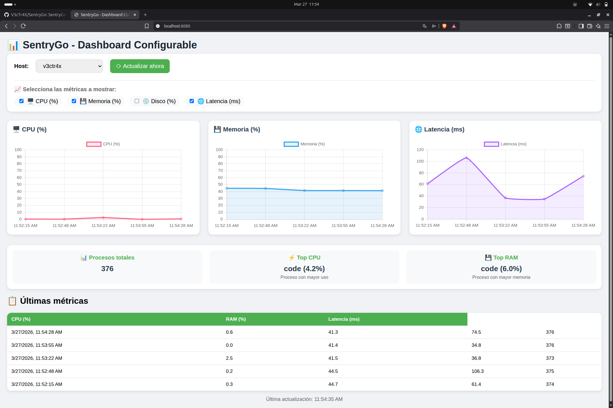

# SentryGo – Lightweight Client‑Server Monitoring

[](https://go.dev/)
[](LICENSE)

SentryGo is a minimalistic monitoring system with a classic client‑server architecture.  
The **agent** collects system metrics (CPU, memory, disk) from a host and sends them periodically to the **server**.  
The server stores the data in SQLite, exposes a REST API, and serves a **web dashboard** that displays real‑time graphs.

It’s ideal for small businesses, homelabs, or anyone who wants a lightweight alternative to Nagios or Zabbix.

## 🚀 Features

- ✅ **Lightweight agent** – a single Go binary that runs as a daemon / Windows service.
- ✅ **Self‑contained server** – embedded SQLite, no external database required.
- ✅ **Modern dashboard** – dynamic charts for CPU, RAM, and disk, auto‑refreshing.
- ✅ **Cross‑platform** – compiles for Linux, Windows, and macOS.
- ✅ **Simple setup** – all in one binary, YAML configuration.
- ✅ **REST API** – easily integrate with other tools.

## 🧱 Architecture

[ Dashboard Web ]

↑

[ Agent ] → [ Server ] → [ SQLite ]


- **Agent** (Go): collects metrics and sends them via HTTP every `interval` seconds.
- **Server** (Go): receives metrics, stores them in SQLite, serves a REST API.
- **Dashboard**: HTML/JS that consumes the API and renders charts using Chart.js.

## 📦 Requirements

- Go 1.21+ (to compile from source)
- (Optional) Docker – for isolated testing

## 🛠️ Build from source

```bash
git clone https://github.com/[your-username]/SentryGo.git
cd SentryGo

# Build server
go build -o sentrygo-server cmd/server/main.go

# Build agent
go build -o sentrygo-agent cmd/agent/main.go
```
To build for different platforms:
```bash
# Linux amd64
GOOS=linux GOARCH=amd64 go build -o sentrygo-server-linux cmd/server/main.go
GOOS=linux GOARCH=amd64 go build -o sentrygo-agent-linux cmd/agent/main.go

# Windows amd64
GOOS=windows GOARCH=amd64 go build -o sentrygo-server.exe cmd/server/main.go
GOOS=windows GOARCH=amd64 go build -o sentrygo-agent.exe cmd/agent/main.go

# macOS amd64
GOOS=darwin GOARCH=amd64 go build -o sentrygo-server-darwin cmd/server/main.go
GOOS=darwin GOARCH=amd64 go build -o sentrygo-agent-darwin cmd/agent/main.go
```

# ⚙️ Configuration Server

No configuration needed – it listens on :8080 and creates a sentrygo.db file.

# Agent

Create a config.yaml file in the same directory as the agent binary:

```ỳaml
server_url: "http://localhost:8080/api/metrics"
token: "your-secret-token"      # (optional, not validated yet)
interval: 30                     # seconds between sends
```
# ▶️ Usage

1. Start the server:

```bash
./sentrygo-server
```

2. Open the dashboard at http://localhost:8080.

3. In another terminal, start the agent:

```bash
./sentrygo-agent
```

4. Watch the metrics appear in real‑time.

# 📸 Screenshots



# 🗺️ Roadmap

- Chart type selection (line, bar, area)

- Automatic data retention (delete records older than 30 days)

- Alerting system (email, webhooks)

- Agent authentication with tokens

- Plugin support for custom metrics

- Packaging as systemd / Windows Service

# 🤝 Contributing

Contributions are welcome! Please open an issue or submit a pull request.

# 📄 License

This project is licensed under the MIT License – see the LICENSE file for details.

**Note**: This project is in pre‑alpha stage. APIs may change. Use at your own risk.

